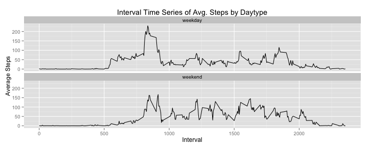

```r
library(knitr)
options(digits=7)
opts_chunk$set(warning=FALSE, fig.height=4, fig.width=8, fig.path="figure/")
```

## Loading and preprocessing the data
##### 1) Unzip the zipped data file, read the datafile, preprocess date column that is in string format to date format


```r
zipfile <- list.files(path=".", pattern="*.zip")
if (file.exists(zipfile)) {
        zipname <- unzip(zipfile, list=TRUE)
        unzip(zipfile)
        datafile <- zipname$Name
}

activity <- read.csv(datafile, header=TRUE, sep=",", stringsAsFactors=FALSE)
```

##### 2) Preprocess the read data which has date column in string format to date format


```r
activity$date <- as.Date(activity$date, format="%Y-%m-%d")
```
## What is mean total number of steps taken per day?

##### 1) Histogram of total number of steps taken each day


```r
library(ggplot2)
par(mai=c(1,1,1,1))
ggplot(activity, aes(x=date, y=steps)) + 
     geom_histogram(stat="identity") + 
     labs(x="Days", y="Steps", title="Total Steps/Day")
```

 

##### 2) Mean and Median total number of steps taken per day displayed in HTML format


```r
meansteps <- mean(rowsum(activity$steps, activity$date), na.rm=TRUE)
mediansteps <- median(rowsum(activity$steps, activity$date), na.rm=TRUE)
statdf <- data.frame(cbind(meansteps, mediansteps))
names(statdf) <- c("mean", "median")
statdf
```

```
##       mean median
## 1 10766.19  10765
```

## What is the average daily activity pattern?

##### 1) Time series plot of the 5 minute interval (x-axis) and the average number of steps taken, averaged across all days (y-axis)


```r
library(ggplot2)
par(mai=c(1,1,1,1))
ggplot(activity, aes(x=interval, y=steps)) + 
     stat_summary(fun.y="mean", geom="line") + 
     labs(y="Average Steps", x="Interval", 
          title="Interval time Series of Avg number of Steps for all Days")
```

 

##### 2) The 5-minute interval, on average across all the days in the dataset, that contains the maximum number of steps


```r
tmp <- aggregate(steps ~ interval, data=activity, FUN=mean)
maxsteps <- tmp[which.max(tmp$steps),]$steps
maxstepsintl <- tmp[which.max(tmp$steps),]$interval
maxstepsintl_rng <- paste(maxstepsintl-5, maxstepsintl, sep=" to ")
maxsteps_lowtm <- paste((maxstepsintl-5) %/% 100, (maxstepsintl-5) %% 100, sep=":")
maxsteps_uptm <- paste(maxstepsintl %/% 100, maxstepsintl %% 100, sep=":")
maxstepstm_rng <- paste(maxsteps_lowtm, maxsteps_uptm, sep=" to ")
resdf <- data.frame(cbind(maxsteps, maxstepsintl_rng, maxstepstm_rng))
names(resdf) <- c("Max Steps", "Interval", "Interval H:MM")
resdf
```

```
##          Max Steps   Interval Interval H:MM
## 1 206.169811320755 830 to 835  8:30 to 8:35
```

## Imputing missing values

##### 1) Total number of missing values in the dataset (i.e. the total number of rows with NAs) is `2304`

```r
missingvalues <- sum(is.na(activity$steps))
missingvalues
```

```
## [1] 2304
```

##### 2) Create a data frame that will contain steps at 5 minute interval mean across all days


```r
intervalmean <- aggregate(steps ~ interval, data=activity, FUN=mean)
```

##### 3) Make a copy of the original activity dataset called `nafilledactivity` dataset that has all the NAs filled in


```r
tmpdf <- merge(activity, intervalmean, by="interval")
nafilledactivity <- transform(tmpdf, steps=ifelse(is.na(steps.x), steps.y, steps.x))[c(5,3,1)]
```

##### - Total number of missing values in the `NA filled` dataset (i.e. the total number of rows with NAs) is `0`

```r
nafilled_missingvalues <- sum(is.na(nafilledactivity$steps))
nafilled_missingvalues
```

```
## [1] 0
```

##### 4) Histogram of the total number of steps for `NA filled` dataset


```r
library(ggplot2)
par(mai=c(1,1,1,1))
ggplot(nafilledactivity, aes(x=date, y=steps)) + 
     geom_histogram(stat="identity") + 
     labs(x="Days", y="Steps", title="Total (NA Filled) Steps/Day")
```

 

##### 4) Mean and Median total number of steps taken per day for `NA filled` dataset displayed in HTML format


```r
nafilledmeansteps <- mean(rowsum(nafilledactivity$steps, nafilledactivity$date))
nafilledmediansteps <- median(rowsum(nafilledactivity$steps, nafilledactivity$date))
nafilledstatdf <- data.frame(cbind(nafilledmeansteps, nafilledmediansteps))
names(nafilledstatdf) <- c("mean", "median")
nafilledstatdf
```

```
##       mean   median
## 1 10766.19 10766.19
```

##### 4) The values between the `activity (original)` dataset and the `nafilledactivity (new)` dataset differ as shown in the table below.


```r
names(statdf) <- c("Original Mean", "Original Median")
names(nafilledstatdf) <- c("NA Filled Mean", "NA Filled Median")
cbind(statdf, nafilledstatdf)
```

```
##   Original Mean Original Median NA Filled Mean NA Filled Median
## 1      10766.19           10765       10766.19         10766.19
```

##### 4) The impact of imputing the missing data by the mean of 5 minute interval across all days  

      a) There were 8 days that had NA in the original activity data set
      b) The total steps for each of those 8 days will equal the computed mean of 5 minute interval across all days
      c) The mean remains the same


```r
tmp1 <- do.call("paste", nafilledactivity)
tmp2 <- do.call("paste", activity)
narows <- nafilledactivity[!tmp1 %in% tmp2,]
aggregate(steps ~ date, narows, sum)
```

```
##         date    steps
## 1 2012-10-01 10766.19
## 2 2012-10-08 10766.19
## 3 2012-11-01 10766.19
## 4 2012-11-04 10766.19
## 5 2012-11-09 10766.19
## 6 2012-11-10 10766.19
## 7 2012-11-14 10766.19
## 8 2012-11-30 10766.19
```

## Are there differences in activity patterns between weekdays and weekends?

##### 1) Create a new factor variable in the dataset with two levels – `weekday` and `weekend` indicating whether a given date is a weekday or weekend day. Display the first few rows to show the `daytype` column being added


```r
weekdayabr <- weekdays(nafilledactivity$date, abbreviate=TRUE)
nafilled_activity_factor = 
     within(nafilledactivity, 
            {daytype = ifelse(weekdayabr == "Sat" | weekdayabr == "Sun", 
                              "weekend", "weekday")
            })
head(nafilled_activity_factor)
```

```
##      steps       date interval daytype
## 1 1.716981 2012-10-01        0 weekday
## 2 0.000000 2012-11-23        0 weekday
## 3 0.000000 2012-10-28        0 weekend
## 4 0.000000 2012-11-06        0 weekday
## 5 0.000000 2012-11-24        0 weekend
## 6 0.000000 2012-11-15        0 weekday
```

##### 2) Panel plot containing a time series plot of the 5-minute interval (x-axis) and the average number of steps taken, averaged across all weekday days or weekend days (y-axis)


```r
library(ggplot2)
par(mai=c(1,1,1,1))
ggplot(nafilled_activity_factor, aes(x=interval, y=steps)) + 
     stat_summary(fun.y="mean", geom="line") + 
     labs(y="Average Steps", x="Interval", 
          title="Interval Time Series of Avg. Steps by Daytype") + 
     facet_wrap(~ daytype, nrow=2)
```

 

